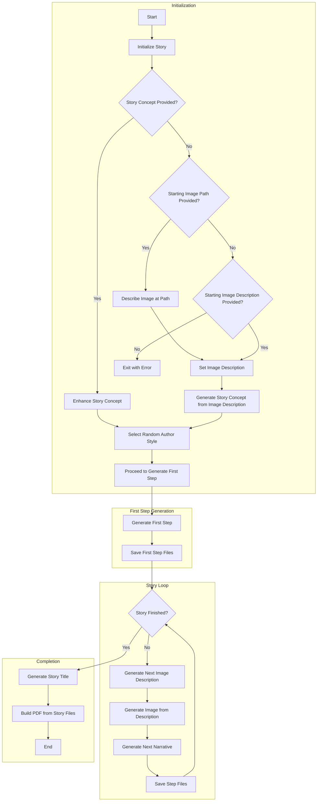

# Spooklight 🔥


Spooklight is an image-driven generative storytelling tool. It uses a multimodal LLM to generate narratives driven by descriptions of images, and to generate images from narratives. These activities alternate in a cycle, extending the story and adding new images to the narrative.

The name "spooklight" refers to an American folk name for the will-o-the-wisp, a mystical being that leads people deep into mysterious places.

## Methodology

The primary methodology of the project is to use a multimodal LLM to observe and describe images, using those observations as the guiding "ground truths" for the LLM to generate narratives and images. This injection of an externalized stochastic process into the LLM allows for a richer and more diverse generation of text, while simultaneously providing a rich set of images that enhance the story.

The title of the story will be generated by the LLM as a final step of the processing. This allows the title to be created based on the overall flow of the narrative that was generated.

## Output

The tool produces output in the form of a series of images and their associated narratives. By default, these are saved in a directory named `output` in the current working directory, with each file named according to the step number. For example, the first image in the story will be saved as `output/0.png`, and the first narrative will be saved as `output/0.txt`.

Additionally, the tool generates a title for the story, saved as `output/title.txt`, and a compiled PDF document containing the entire story, including all images and narratives, saved as `output/story.pdf`. The PDF will also include the contents of a file named `concept.txt` on the first page, which contains the story's concept.

## Flowchart

The following flowchart illustrates the process of generating a story using Spooklight:



## Configuration Parameters

The tool has various parameters that can be provided at execution time, which control the nature of the generation process. These parameters are:

- `--starting-image-path`: A string that specifies the path to the image that will be used as the starting point for the story.
- `--starting-image-description`: A string that will be used as the prompt for the LLM to generate the first image in the story. This image will be used as the starting point for the story. This will be ignored if the `starting-image-path` parameter is provided.
- `--story-concept`: A string that provides a summary of the story concept. This will be used throughout the story at every step to provide context and guide the LLM. If not provided, the tool will use the `starting-image-description` parameter to generate a story concept.
- `--story-length`: An integer that specifies the length of the story in terms of the number of steps. Each "step" is a single image and associated narrative.

### Default Behaviors and Error Handling

- If neither the `starting-image-path` nor the `starting-image-description` parameter is provided, the tool will use the story concept to generate an image description and then use that description to generate the first image in the story. If the story concept has not been provided in this case, the tool will exit with an error.
- If the `story-length` parameter is not provided, the story will continue until it reaches a natural conclusion, or until the user manually terminates the tool.

Please note that the only required parameter is the `story-concept` parameter.

## Usage

The entry point for the Spooklight tool from the command line is `cli.py`. To execute the tool, simply run the following command:

```bash
python cli.py --story-concept "An unlikely rebellion of oppressed people fighting against a tyrannical council of wizards"
```

This will generate a story with a single image and narrative, based on the provided story concept. If you'd like to specify a starting image or limit the story length, include the appropriate parameters:

```bash
python cli.py --starting-image-path "path/to/image.png" --story-concept "An epic journey through uncharted lands" --story-length 10
```

If you wish to start the story from a description rather than an image, you can use the `--starting-image-description` parameter like this:

```bash
python cli.py --starting-image-description "A misty forest at dawn with a mysterious figure in the distance" --story-concept "A lone wanderer discovers an ancient secret in the forest"
```

## License

Spooklight is released under the [MIT License](LICENSE).
